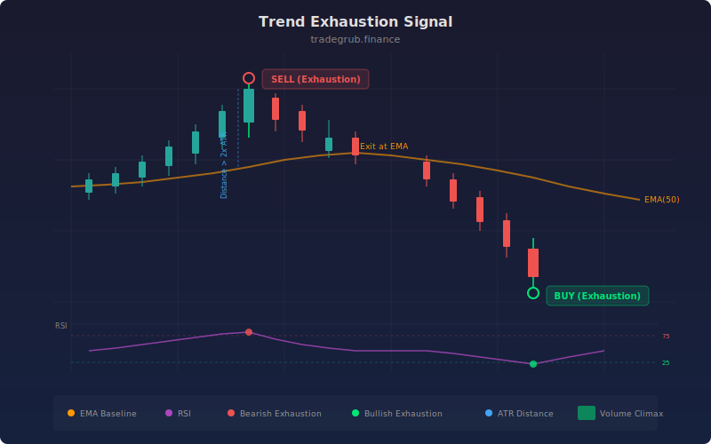

# Trend Exhaustion Signal

Trend Exhaustion Signal detects when a price move has stretched too far from its mean and is likely to reverse. It combines distance-from-moving-average analysis with RSI extremes and optional volume climax confirmation to filter for high-probability reversal zones.

## Conceptual Diagram



## How It Works

The strategy measures how far price has traveled from its exponential moving average, normalized by ATR to account for volatility. When price extends beyond a configurable threshold (default: 2x ATR), the trend is considered overextended. This alone is not enough for a signal.

The RSI filter confirms momentum exhaustion. A reading above 75 during an upside extension, or below 25 during a downside extension, indicates that buying or selling pressure is reaching unsustainable levels. The optional volume climax filter adds a third layer: a volume spike above 1.8x the 20-period average suggests capitulation or blow-off activity.

Entries trigger when all conditions align. Exits occur when price crosses back through the moving average, signaling that the mean-reversion move is complete.

## Parameters

| Name | Default | Range | Description |
|------|---------|-------|-------------|
| MA Length | 50 | 10-200 | Period for the exponential moving average baseline |
| RSI Length | 14 | 5-30 | Lookback period for RSI calculation |
| RSI Overbought | 75.0 | 65-90 | RSI level that confirms upside exhaustion |
| RSI Oversold | 25.0 | 10-35 | RSI level that confirms downside exhaustion |
| Distance Multiplier | 2.0 | 1.0-4.0 | ATR multiple required for overextension |
| Volume Spike Mult | 1.8 | 1.2-3.0 | Multiple of average volume for climax detection |
| ATR Length | 14 | 5-30 | Period for ATR normalization |
| Require Volume Climax | True | on/off | Whether to require a volume spike for confirmation |

## Python Advantage

Vectorized boolean masking makes multi-condition filtering clean and fast:

```python
distance = (close - ma) / atr
vol_spike = volume > (vol_ma * vol_mult)

bear_exhaustion = (distance > dist_mult) & (rsi > rsi_upper) & vol_spike
bull_exhaustion = (distance < -dist_mult) & (rsi < rsi_lower) & vol_spike
```

All three conditions evaluate across the entire price history in a single pass with no row-by-row loops.

## When to Use

This strategy works best on instruments that exhibit mean-reverting behavior after sharp directional moves. Stocks with strong trending tendencies, crypto pairs during mania phases, and indices during panic selloffs all produce reliable exhaustion signals. Shorter MA lengths (20-30) suit intraday timeframes, while longer settings (50-100) work on daily and weekly charts.

## Risk Management

Exhaustion signals are counter-trend by nature, so position sizing should be conservative. A trend can remain overextended longer than expected, particularly during macro-driven moves. Use the ATR-based distance measurement to set stop losses just beyond the exhaustion extreme, and consider scaling into positions rather than entering full size on the first signal.

## Combining with Other Indicators

- **Bollinger Bands:** A signal firing while price is outside the upper or lower band adds confluence for a reversal.
- **Support and Resistance:** Exhaustion signals near established horizontal levels or Fibonacci retracements carry more weight.
- **MACD Histogram Divergence:** When price makes a new high or low but the MACD histogram does not, the exhaustion signal gains additional confirmation.
