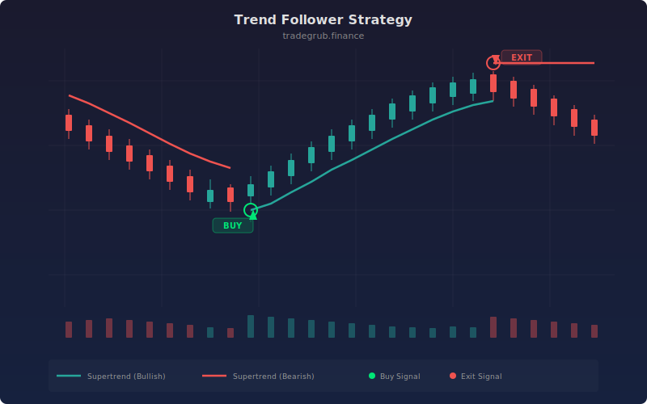

# Trend Follower Strategy

SuperTrend-style trend following strategy with a self-adjusting ATR multiplier. The multiplier scales based on the ATR percentile rank over a 50-bar window, widening the bands in volatile conditions and tightening them in quiet markets. The dynamic trend line acts as both a directional filter and a trailing stop, flipping the position when price breaks through.

## Concept

## Parameters

- **ATR Length**: ATR period (default: 10)
- **Base Multiplier**: Base ATR multiplier for trend bands (default: 3.0)
- **Take Profit ATR Mult**: Take profit distance in ATR units (default: 3.0)

## Signals

- **Long**: Price breaks above dynamic upper band
- **Short**: Price breaks below dynamic lower band
- **Trailing stop**: Dynamic trend line acts as trailing stop
