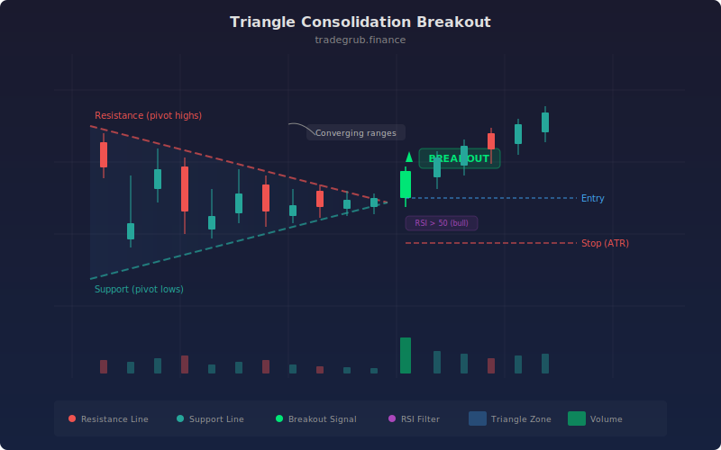

# Triangle Consolidation Break

This strategy detects symmetrical, ascending, and descending triangle patterns by tracking the convergence of pivot highs and pivot lows over a configurable lookback window. When price breaks out of the triangle boundary with RSI and optional volume confirmation, it enters a directional trade with ATR-based stop management.

## Conceptual Diagram



## How It Works

The strategy identifies triangle formations by comparing the current high-low range over the lookback period against the range from a prior window. When the current range is narrower than the previous range, price is converging into a triangle. The strategy classifies the triangle type by checking whether the upper boundary (pivot highs) or lower boundary (pivot lows) is flat relative to ATR.

For ascending triangles (flat top, rising lows), the strategy looks for upside breakouts. For descending triangles (flat bottom, falling highs), it watches for downside breakouts. Symmetrical triangles can break in either direction. A breakout is confirmed when price closes beyond the boundary line with RSI above the bull threshold (for longs) or below the bear threshold (for shorts).

Volume confirmation is enabled by default. When active, breakout signals require volume to exceed the 20-period average by at least 20%, filtering out low-conviction moves that are more likely to fail.

## Parameters

| Name | Default | Range | Description |
|------|---------|-------|-------------|
| Lookback Period | 50 | 20-100 | Number of bars used to define the triangle boundaries |
| Pivot Length | 5 | 2-10 | Window for detecting local pivot highs and lows |
| RSI Length | 14 | 5-30 | Period for the RSI momentum filter |
| RSI Bull Threshold | 50.0 | 40-60 | Minimum RSI value required for long entries |
| RSI Bear Threshold | 50.0 | 40-60 | Maximum RSI value required for short entries |
| ATR Stop Multiplier | 1.5 | 0.5-4.0 | ATR multiple used for stop-loss distance |
| ATR Length | 14 | 5-30 | Period for ATR calculation |
| Volume Confirmation | True | on/off | Require above-average volume on breakout |

## Python Advantage

Vectorized boundary detection runs across the full price history in a single pass:

```python
range_width = upper_line - lower_line
prev_width = upper_line.shift(pivot_len) - lower_line.shift(pivot_len)
converging = range_width < prev_width

bull_break = (close > upper_line.shift(1)) & (rsi > rsi_bull)
bear_break = (close < lower_line.shift(1)) & (rsi < rsi_bear)
```

This avoids bar-by-bar iteration for pattern detection, handling convergence checks and breakout signals across thousands of bars simultaneously.

## When to Use

Triangle patterns form frequently in trending markets during consolidation phases. This strategy works best on instruments that alternate between trending and ranging behavior. Apply it to daily or 4-hour timeframes for the most reliable triangle formations. Shorter timeframes produce more signals but with lower reliability.

## Risk Management

The ATR-based stop provides adaptive risk control that widens during volatile conditions and tightens during calm markets. The default 1.5x ATR multiplier balances between giving trades room to breathe and cutting losses quickly. Increase the multiplier on volatile instruments or longer timeframes. Combine with position sizing rules to limit risk per trade to a fixed percentage of account equity.

## Combining with Other Indicators

- **Volume Profile:** Overlay volume profile to confirm that breakouts occur at levels with thin volume, indicating less resistance to price movement.
- **Moving Averages:** Use a 200-period SMA as a directional filter. Only take long breakouts above the SMA and short breakouts below it.
- **MACD:** Confirm breakout momentum with MACD histogram direction. A rising histogram supports long entries while a falling histogram supports shorts.
