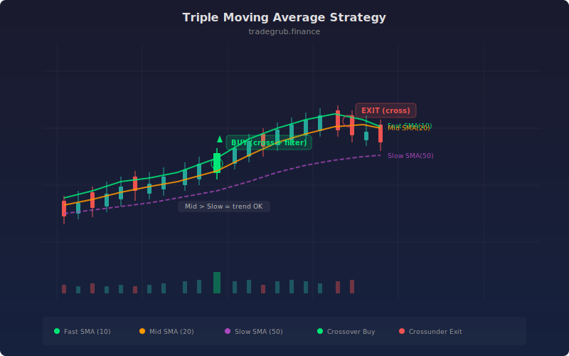

# Triple Moving Average

The Triple Moving Average strategy uses three simple moving averages of different speeds to filter trades through multiple layers of trend confirmation. By requiring the fast SMA to cross above the mid SMA while the mid SMA is already above the slow SMA, the strategy ensures entries only occur when short-term momentum aligns with the established trend direction. This three-tier approach, evolved from the classic dual-MA crossover systems of the 1970s, dramatically reduces whipsaw losses in choppy markets.

## Conceptual Diagram



## How It Works

The strategy computes three simple moving averages: a fast SMA (default 10 bars), a mid SMA (default 20 bars), and a slow SMA (default 50 bars). Each captures a different timeframe of price momentum, from short-term fluctuations to the long-term trend direction.

The entry condition has two requirements. First, the fast SMA must cross above the mid SMA, signaling that short-term momentum is accelerating. Second, the mid SMA must already be above the slow SMA at the time of the crossover, confirming the broader trend is bullish. Both conditions must be true simultaneously on the most recent bar.

Exits trigger when the fast SMA crosses below the mid SMA, indicating short-term momentum has reversed. This is a long-only strategy that captures uptrend momentum while the three-tier filter keeps it flat during downtrends and range-bound conditions.

A fill zone between the fast and mid SMA provides visual feedback on the momentum spread. When the fill is expanding, momentum is accelerating. When it narrows, the exit is approaching.

## Parameters

| Parameter | Default | Range | Description |
|-----------|---------|-------|-------------|
| Fast SMA | 10 | 2 - 50 | Short-term moving average period for momentum timing |
| Mid SMA | 20 | 5 - 100 | Medium-term moving average period for crossover signals |
| Slow SMA | 50 | 20 - 200 | Long-term moving average for trend direction filter |

## Python Advantage

The strategy computes three independent SMA arrays and combines crossover detection with a trend filter in a single compound condition:

```python
# Three vectorized SMA computations — full array in one call each
fast_sma = ta.sma(close, fast_len)
mid_sma = ta.sma(close, mid_len)
slow_sma = ta.sma(close, slow_len)

# Compound entry: crossover + trend alignment in one boolean expression
long_cond = ta.crossover(fast_sma, mid_sma)[-1] and mid_sma[-1] > slow_sma[-1]
```

The `ta.crossover(fast_sma, mid_sma)` call compares two full numpy arrays and returns a boolean array of all crossover points. The `[-1]` index grabs the most recent bar, and the `and` operator combines it with the trend filter. Pine evaluates this one bar at a time and cannot batch-compute crossovers between two array pipelines for downstream analysis. The `fill(p1, p2)` call between two plot references is a clean Python pattern for visual momentum spread.

## When to Use

Triple MA works best on instruments with sustained trending behavior: large-cap stocks, index ETFs, and major forex pairs during trend regimes. Daily and 4-hour charts provide the cleanest signals. The slow SMA filter keeps the strategy flat during ranging markets, making it suitable as a set-and-forget trend-following system. Avoid on highly mean-reverting instruments where trends are short-lived.

## Risk Management

The strategy has no built-in stop-loss; exits rely entirely on the fast/mid SMA crossunder. In sharp reversals, the SMA lag can result in giving back significant profits before the exit triggers. Consider adding an ATR-based trailing stop or a maximum drawdown threshold. Position sizing should be based on the distance between the entry price and the slow SMA, which acts as a natural support reference.

## Combining with Other Indicators

- **Squeeze Momentum** confirms that volatility expansion supports the MA crossover, filtering out low-energy crosses.
- **ADX Trend + RSI Momentum Filter** validates that the trend has genuine directional strength before following the MA signal.
- **Supertrend** provides a trailing stop line that can replace the SMA crossunder exit with a more adaptive exit.
