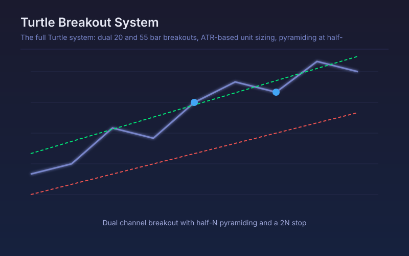

# Turtle System (Dual Breakout + Pyramiding)

The full Turtle system: dual 20 and 55 bar breakouts, ATR-based unit sizing, pyramiding at half-N intervals and a 2N stop.

## Conceptual Diagram

## Parameters

| Parameter | Default | Range | Description |
|-----------|---------|-------|-------------|
| System 1 entry (bars) | 20 | 5-100 | Fast breakout channel length |
| System 1 exit (bars) | 10 | 3-50 | Fast exit channel length |
| System 2 entry (bars) | 55 | 20-200 | Slow breakout channel length |
| System 2 exit (bars) | 20 | 5-100 | Slow exit channel length |
| N (ATR) length | 20 | 5-100 | ATR length that defines one unit of volatility |
| Stop distance in N | 2.0 | 0.5-5.0 | Initial stop distance measured in N |
| Max pyramid units | 4 | 1-6 | Maximum units added to a winning position |

## Signals

- Long entry: close above the 20 or 55 bar high, whichever triggers first
- Short entry: close below the 20 or 55 bar low
- Pyramid: each further half-N of favourable movement adds a unit, up to the cap
- Exit: the opposite exit channel or the 2N stop, whichever comes first

## Not the same as Donchian Channel Breakout

The marketplace already ships `donchian-breakout`, which trades a single 20/10
channel with an ATR trailing stop. This script adds the parts of the original
Turtle rules that one leaves out: the slower System 2 channel running alongside
System 1, position sizing in units of N, pyramiding a further unit every half-N
of favourable movement, and the hard 2N stop. Use that one for a clean single
breakout, this one for the full system.

## Usage

Use on liquid, genuinely trending markets such as index futures, major FX and large-cap crypto. The system expects a low win rate and a small number of very large winners, so cutting the pyramid short defeats the point of it.
