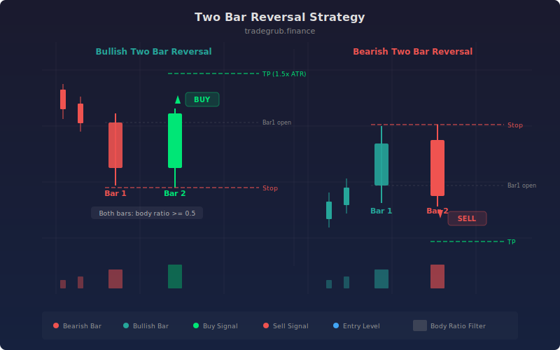

# Two Bar Reversal

The Two Bar Reversal strategy detects sharp momentum shifts where a strong directional candle is immediately followed by an equally strong candle in the opposite direction. This two-bar pattern, widely recognized in price action trading, captures the moment when one side of the market exhausts itself and the other side seizes control. The strategy enforces minimum body-to-range ratios to ensure both bars represent decisive moves rather than indecisive doji-like candles.

## Conceptual Diagram



## How It Works

The strategy calculates the body size (absolute difference between close and open) and the full candle range (high minus low) for every bar. The body ratio is computed as body divided by range, with a safety check for zero-range bars. Both bars in the pattern must exceed the minimum body ratio threshold (default 0.5), ensuring they are strong directional candles.

A bullish two-bar reversal requires four conditions. Bar 1 must be bearish (close below open) with a qualifying body ratio. Bar 2 must be bullish (close above open) with a qualifying body ratio. Bar 2's close must exceed Bar 1's open, proving the reversal surpassed the starting point of the prior move. Bar 2's open must be at or below Bar 1's close, confirming the bullish bar started from the depth of the bearish bar.

The bearish pattern mirrors this logic: a strong bullish bar followed by a strong bearish bar that opens at or above the prior close and closes below the prior open. This engulfing-like structure signals a decisive shift in market control.

Each entry includes a defined stop-loss and profit target. Stops are placed beyond the pattern's extreme (lowest low for bullish, highest high for bearish) with a 0.3 ATR buffer. Targets use the ATR target multiplier, providing a clear risk-reward framework.

## Parameters

| Parameter | Default | Range | Description |
|-----------|---------|-------|-------------|
| ATR Length | 14 | 5 - 50 | Lookback period for ATR used in stop and target calculations |
| ATR Target Multiplier | 1.5 | 1.0 - 5.0 | Multiplier applied to ATR for profit target distance |
| Min Body Ratio | 0.5 | 0.3 - 0.8 | Minimum body-to-range ratio required for both bars |

## Python Advantage

The strategy uses numpy's vectorized absolute value and conditional division for body ratio computation across the entire dataset:

```python
# Vectorized body and range computation — numpy operates on full arrays
body = np.abs(close - open)
candle_range = high - low
body_ratio = np.where(candle_range > 0, body / candle_range, 0)

# Multi-bar pattern detection with negative indexing
bar1_bearish = close[-2] < open[-2] and body_ratio[-2] >= min_body
bar2_bullish = close[-1] > open[-1] and body_ratio[-1] >= min_body

# Compound pattern with engulfing-style price relationship
bull_2bar = (bar1_bearish and bar2_bullish and
             close[-1] > open[-2] and open[-1] <= close[-2])
```

The `np.where(candle_range > 0, body / candle_range, 0)` expression handles the zero-division edge case across the entire array in a single vectorized call. Pine would require a per-bar ternary or `nz()` wrapper. The `np.abs()` function computes absolute values across the full price history without a loop.

## When to Use

Two-bar reversals work on all timeframes but are most effective on daily and 4-hour charts for swing trading at the end of extended moves. The pattern is especially powerful at known support/resistance levels, round numbers, and previous swing highs/lows. It works across all asset classes: stocks, forex, crypto, and futures. Lower timeframes produce more signals but with higher noise.

## Risk Management

The built-in stop and target provide defined risk per trade. The stop placement beyond the pattern extreme with an ATR buffer accounts for normal volatility without being too tight. At the default 1.5x ATR target, the reward-to-risk ratio depends on the pattern size relative to ATR. Increase the target multiplier on trending instruments; decrease it on range-bound ones. The body ratio filter is the primary quality control: raising it to 0.6 or 0.7 produces fewer but cleaner patterns.

## Combining with Other Indicators

- **RSI Divergence** confirms the reversal occurs with momentum divergence, dramatically increasing signal quality.
- **VWAP Bounce** validates that the pattern forms near institutional volume-weighted levels.
- **Std Dev Channel** identifies whether the reversal occurs at a statistically significant channel extreme.
