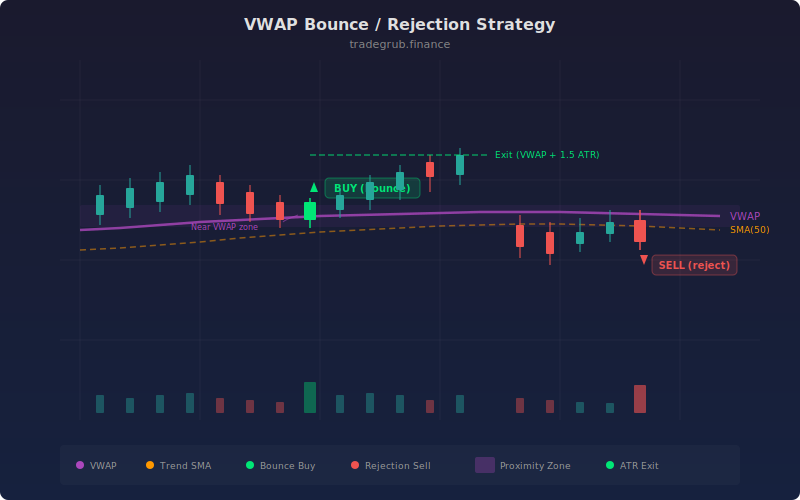

# VWAP Bounce/Rejection

The VWAP Bounce/Rejection strategy trades price reactions at the Volume Weighted Average Price, a key institutional reference level that represents the average price weighted by volume throughout the trading session. Institutional traders frequently benchmark their execution against VWAP, making it a natural magnet for price action. This strategy identifies moments when price touches the VWAP zone and bounces in the direction of the prevailing trend, capturing the continuation move that follows institutional order flow.

## Conceptual Diagram



## How It Works

The strategy computes VWAP from high, low, close, and volume data, then defines a proximity zone around it using ATR. A bar is considered "near VWAP" when the absolute distance between the close and the VWAP value is less than the bounce ATR multiplier (default 0.5) times the current ATR. This adaptive zone widens during volatile conditions and tightens during calm periods.

Trend direction is determined by a simple moving average of configurable length (default 50). When price is above the trend SMA, the market is considered bullish. When below, bearish. This prevents bounce trades against the dominant trend direction.

A bullish bounce entry triggers when three conditions align: price is near VWAP, the close is above the trend SMA (uptrend), and the close is above VWAP (bouncing up, not down). A bearish rejection entry fires when price is near VWAP, below the trend SMA (downtrend), and below VWAP (rejecting downward).

Exits occur when price moves a configurable distance away from VWAP, calculated as the exit ATR multiplier (default 1.5) times ATR. This captures the move away from the VWAP magnet without waiting for a trend reversal.

## Parameters

| Parameter | Default | Range | Description |
|-----------|---------|-------|-------------|
| ATR Length | 14 | 5 - 50 | Period for ATR used in proximity and exit zone calculations |
| Bounce ATR Multiplier | 0.5 | 0.1 - 2.0 | How close price must be to VWAP to qualify as a bounce (in ATR units) |
| Exit ATR Multiplier | 1.5 | 0.5 - 5.0 | Distance from VWAP at which to take profit (in ATR units) |
| Trend SMA Length | 50 | 10 - 200 | SMA period for determining overall trend direction |

## Python Advantage

The strategy uses numpy's vectorized absolute value and boolean masking to compute proximity zones and compound conditions across the full dataset:

```python
# Vectorized proximity detection — numpy abs across full array
near_vwap = np.abs(close - vwap_val) < bounce_mult * atr

# Compound boolean arrays for directional bounce detection
bull_bounce = near_vwap & (close > trend_sma) & (close > vwap_val)
bear_reject = near_vwap & (close < trend_sma) & (close < vwap_val)

# Scalar exit check via negative indexing
long_exit = close[-1] > vwap_val[-1] + exit_mult * atr[-1]
```

The `np.abs(close - vwap_val)` expression computes the absolute distance between two full numpy arrays in a single vectorized call. The `&` operator chains three boolean arrays into a composite condition. Pine cannot compute `math.abs()` across arrays or combine boolean series with element-wise operators.

## When to Use

VWAP is most meaningful on intraday timeframes (1-minute to 1-hour) where it reflects the session's actual volume-weighted price. The strategy works best on liquid instruments with consistent volume patterns: large-cap stocks, index ETFs, and liquid futures contracts. It is especially effective during the midday session when price often gravitates back to VWAP after the opening volatility subsides. Avoid on daily or higher timeframes where VWAP loses its intraday significance.

## Risk Management

Place stops beyond the opposite side of the VWAP proximity zone (for longs, below VWAP minus the bounce ATR multiplier times ATR). The ATR-based exit provides a natural profit target, but consider tightening the exit multiplier on lower timeframes. The trend SMA filter is the primary risk control: it prevents counter-trend bounces that have a lower success rate. In strongly trending markets, VWAP bounces can produce strings of winners; in choppy markets, the proximity zone may trigger repeatedly with poor follow-through.

## Combining with Other Indicators

- **RSI Mean Reversion** adds momentum confirmation that the VWAP bounce coincides with an oversold/overbought reading.
- **Two Bar Reversal** or **Three Bar Reversal** provides candlestick pattern confirmation at the VWAP touch point.
- **Squeeze Momentum** confirms that volatility is expanding away from VWAP after the bounce entry.
