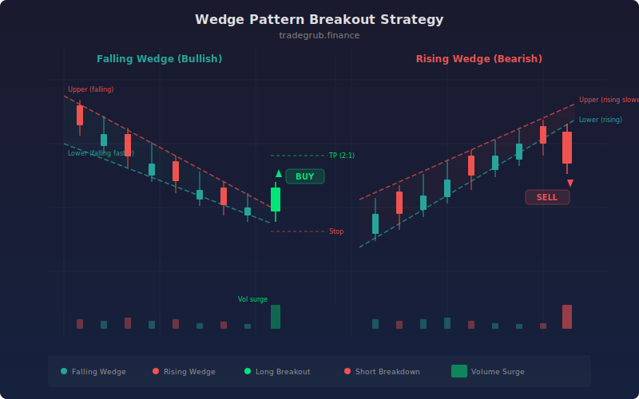

# Wedge Pattern Breakout

A strategy that identifies rising and falling wedge formations by tracking converging trendlines, then enters positions on confirmed breakouts. Volume surge confirmation filters out false breakouts and improves win rate on the directional move following wedge resolution.

## Conceptual Diagram



## How It Works

The strategy calculates upper and lower trendlines using the highest high and lowest low over a configurable lookback period. It measures whether these lines are converging by comparing the current wedge width to the previous width, applying a convergence threshold percentage.

Once a wedge is identified, the strategy classifies it as rising (both slopes positive, bearish bias) or falling (both slopes negative, bullish bias). It then waits for a breakout candle that closes beyond the trendline boundary. When volume confirmation is enabled, the breakout bar must also exceed the 20-period average volume by the specified multiplier.

Entries use ATR-based stop losses and take profit targets. The take profit ratio parameter controls the reward-to-risk multiple. Both long and short positions are managed with symmetric exit logic based on the ATR at the time of entry.

## Parameters

| Name | Default | Range | Description |
|------|---------|-------|-------------|
| Lookback Period | 20 | 10-50 | Number of bars for trendline calculation |
| Volume Multiplier | 1.5 | 1.0-3.0 | Required volume surge above 20-period average |
| ATR Stop Multiplier | 2.0 | 1.0-4.0 | ATR multiple for stop loss distance |
| Min Trendline Touches | 3 | 2-5 | Minimum price touches to validate trendline |
| Convergence Threshold % | 0.5 | 0.1-2.0 | Minimum narrowing rate to qualify as wedge |
| Require Volume Confirmation | True | on/off | Filter breakouts by volume surge |
| Take Profit Ratio | 2.0 | 1.0-5.0 | Reward-to-risk multiple for profit target |
| Show Wedge Lines | True | on/off | Display upper and lower trendlines on chart |

## Python Advantage

Vectorized trendline and convergence detection runs across the full price history in a single pass:

```python
wedge_width = upper_line - lower_line
prev_width = upper_line[1:] - lower_line[1:]
converging = wedge_width < prev_width * (1.0 - converge_pct / 100.0)

rising_wedge = converging & (upper_slope > 0) & (lower_slope > 0)
falling_wedge = converging & (upper_slope < 0) & (lower_slope < 0)
```

This approach processes thousands of bars without explicit loops for pattern detection, keeping the strategy execution fast even on large datasets.

## When to Use

Wedge breakouts work best on instruments with clear trending behavior followed by consolidation phases. Stocks, ETFs, and futures that alternate between trending and contracting ranges produce well-defined wedge patterns. Apply this strategy on 15-minute through daily timeframes. Lower timeframes generate more signals but with higher noise, while daily charts produce fewer but more reliable setups.

## Risk Management

Each trade uses an ATR-based stop placed at a configurable multiple from the entry price. The default 2:1 take profit ratio ensures that winning trades outpace losers even at moderate win rates. Position sizing should account for the ATR stop distance so that each trade risks a consistent percentage of capital. Avoid trading wedge breakouts during low-liquidity sessions or around major news events where gaps can skip the stop level.

## Combining with Other Indicators

- **RSI divergence:** A falling wedge paired with bullish RSI divergence strengthens the long setup. Rising wedges with bearish RSI divergence add conviction to short entries.
- **Moving average context:** Filter trades by the 50 or 200 period moving average to only take falling wedge longs above the MA and rising wedge shorts below it.
- **DMI/ADX:** Use ADX below 25 to confirm the consolidation phase within the wedge, then look for ADX expansion on the breakout bar as additional confirmation.
